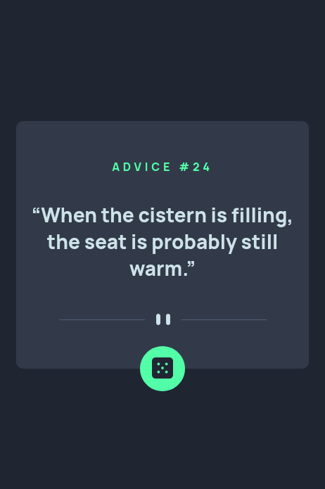

# Frontend Mentor - Advice generator app solution

This is a solution to the [Advice generator app challenge on Frontend Mentor](https://www.frontendmentor.io/challenges/advice-generator-app-QdUG-13db). Frontend Mentor challenges help you improve your coding skills by building realistic projects.

## Table of contents

-    [Overview](#overview)
     -    [The challenge](#the-challenge)
     -    [Screenshot](#screenshot)
     -    [Links](#links)
-    [My process](#my-process)
     -    [Built with](#built-with)
     -    [What I learned](#what-i-learned)
     -    [Useful resources](#useful-resources)
-    [Author](#author)

## Overview

### The challenge

Users should be able to:

-    View the optimal layout for the app depending on their device's screen size
-    See hover states for all interactive elements on the page
-    Generate a new piece of advice by clicking the dice icon

### Screenshot




### Links

-    Solution URL: [GitHub](https://github.com/thirraz/advice-generator-app)
-    Live Site URL: [Netlify](https://stellar-fairy-9d5b23.netlify.app/)

## My process

### Built with

-    Semantic HTML5 markup
-    CSS custom properties
-    Flexbox
-    [React](https://reactjs.org/) - JS library

**Note: These are just examples. Delete this note and replace the list above with your own choices**

### What I learned

I learned how to fetch an API!!!

```js
const fetchData = async () => {
	const random = Math.floor(Math.random() * 130);
	const res = await fetch(`https://api.adviceslip.com/advice/${random}`)
		.then((r) => r.json())
		.then((data) => setAdvice(data.slip))
		.catch((e) => console.warn(e));
};
```

### Useful resources

-    [Fetch and display data from an API with react 🔥🔥 by Rohanmalo](https://medium.com/@64rohanmalo/fetch-and-display-data-from-an-api-with-react-228de56bb446) - This helped me to fetch Advice Slip API

## Author

-    Frontend Mentor - [@thirraz](https://www.frontendmentor.io/profile/thirraz)
-    Twitter - [@thirrazgo](https://www.twitter.com/thirrazgo)
